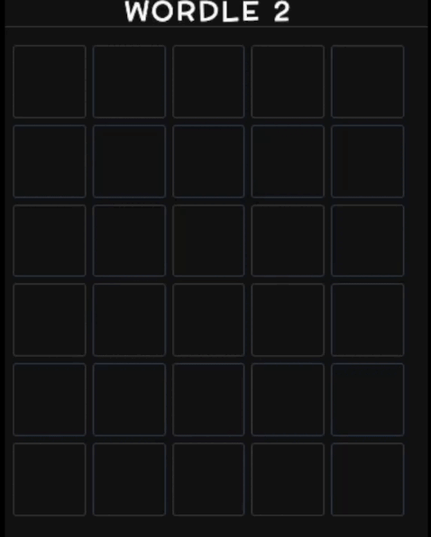

# Wordle Clone
[Wordle Clone](https://wordle-sail--wordle-4lmsa6dh.web.app) is a replication of the popular word-guessing game.

## About Wordle Clone
- Accelerated UI development with ``Tailwind CSS``.
- Enhanced user interaction by adding non-blocking alerts with ``React-Hot-Toast``.
- Boosted type safety to reduce runtime errors with ``TypeScript``.
- Implemented state management with ``useReducer``.

## Built With

    
   
   
   
   
   

Base

- React / Vite
- Tailwind
- ESLint
- TypeScript

Libraries

- react-hot-toast

## Demo

- After entering five letters, a player's guess will be compared to the answer.
<ol>
    <li>
        
When the guess does not match any letters in the answer, the puzzle pieces turn gray.

        
    </li>
    <li>
        
When a letter in the guess matches the answer, but the positions are different, the puzzle piece turns yellow.

        
    </li>
     <li>
        
When a letter in the guess matches the answer, and the position is correct, the puzzle piece turns green.

        
    </li>
     <li>
        
Each game allows the player to guess 6 times at most. If the 6th guess is wrong, a toast saying "答錯了! 再挑戰一次！"  would appear; If the guess is correct, a toast saying "答對了，恭喜!" would appear.

        

            
            
        

    </li>
</ol>

## Contact

   
   

